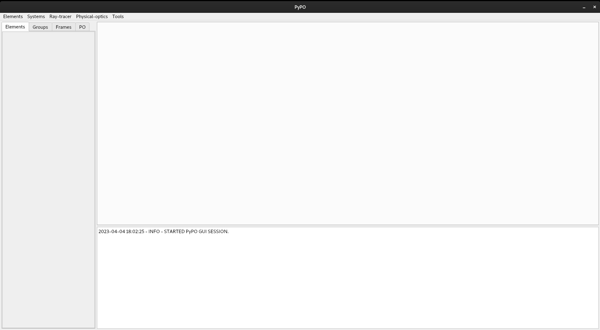
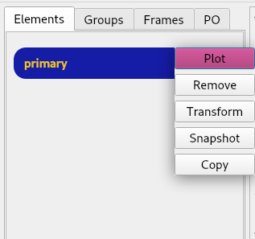
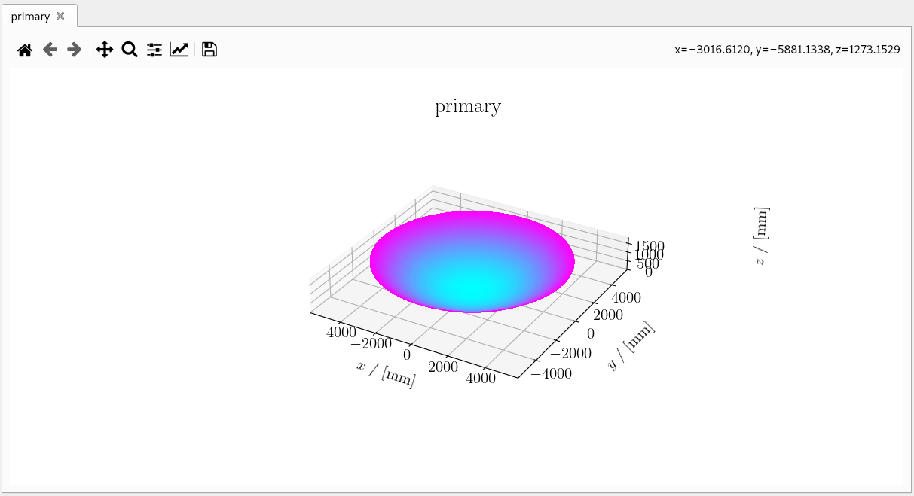
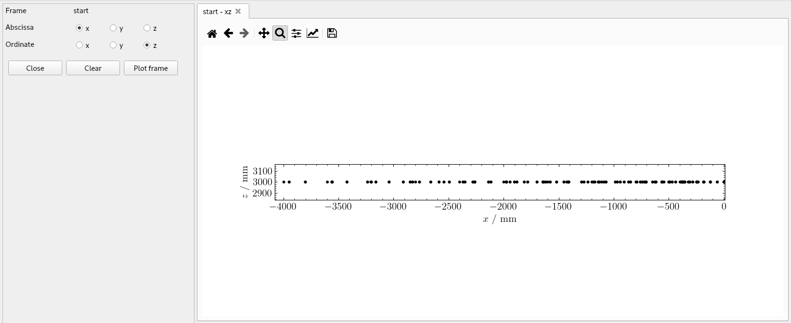
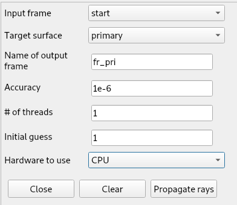
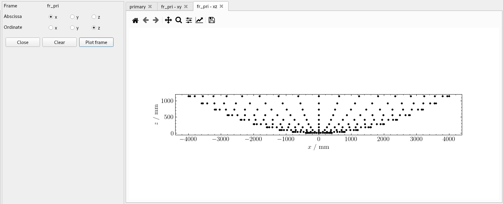
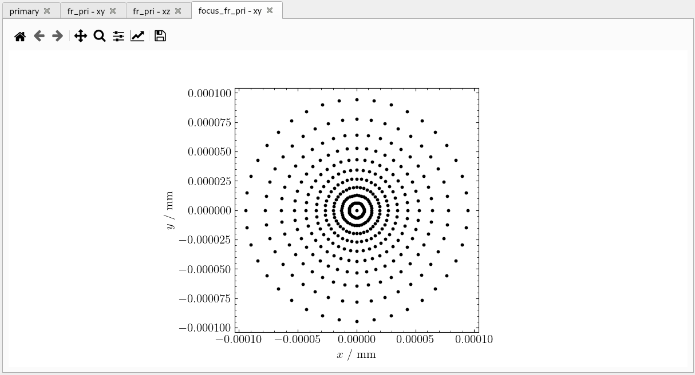

# PyPO GUI Manual

## Starting The GUI
Before we can use the GUI, we have to start it up.
The GUI can only ben used if `PyPO` is installed from source because the GUI source code is only included if directly obtained from Github.
Also make sure that PySide6, pyqtdarktheme and attrs are installed, otherwise the GUI will not launch:
```
pip install PySide6 pyqtdarktheme attrs
```

Navigate to the location of the `PyPO` root directory and run:
```
python GuiApp.py
```

which should launch the GUI.

## Introduction

In this tutorial we will, step by step, build a simple reflector system and perform a ray-trace calculation trough it.
<!---->

The gui consists of 3 widgets:

* Workspace (left)
* Plot screen
* Console

For most interactions a form will show up next to the workspace.


<figure><figcaption>A blank GUI window at startup</figcaption></figure>


## Creating Reflectors
From the elements menu select *Add Reflector* > *Quadric surface*. 

A form will show up with a dropdown selector. Click the button that displays “--Select item--”. You can choose between three different quadric geometries.
Upon clicking a geometry, a new form pops up, containing a bunch of parameters.
By filling in the parameters and clicking *add*, a reflector has been added to the system. If successful, a widget will show up in the workspace as such:

<!---->

<figure><figcaption>System with one paraboloid reflector</figcaption></figure>


If adding the reflector did not succeed a message will be logged in the console with information about what went wrong.

<figure></figure>


## Plotting
To inspect the reflector we just defined, we need to plot it. 
By clicking on the three dots on the right side of the element widget the element options menu will open. The first option is plot. 

<figure><figcaption>Selecting Plot from the element options menu</figcaption></figure>


This will show the plot on the plot screen.

<figure><figcaption>Plot of the paraboloid reflector</figcaption></figure>


## Defining Ray-Trace Frames
Now we will define a ray-trace frame. We can do that from the menu bar by selecting Ray-trace > Make frame > Tube.

Again, a form will show up. We fill it with the following parameters.


<figure><figcaption>Frame parameter form</figcaption></figure>

When the frame is added, a widget will show up in the *Frames* tab of the workspace. By clicking *plot* in the frame options menu we are presented with a form that allows us to choose the plane in which we want to plot this frame. If we select x and y we get the following plot. 

<figure><figcaption>Plot of the frame in xy plane</figcaption></figure>

Now we can see that we have defined a frame on the xy plane with z co-ordinate equal to 0 mm. We can translate this frame upwards by selecting the transform option from the frame options as shown below

<figure><figcaption>Frame transformation form</figcaption></figure>


Now, if we plot the frame again from the side (e.g. in the xz-plane) we can see if the translation was succesful. After zooming in with the zoom tool in the plot, we can see that all of the points have z coordinate equal to 3000 mm and the translation was succesful.

<figure><figcaption>Plot of frame in xy plane</figcaption></figure>

## Propagating Rays

We can propagate the rays of the frame we just created by clicking *Ray trace > Propagate Rays*. Again, a form will show up. We fill it with these parameters: 


<figure><figcaption>For for trace propagation</figcaption></figure>
<figure><figcaption></figcaption></figure>

This will create a new frame *fr_pri*. If we plot this frame in the xy-plane, it will look exactly the same as the previous frame. But looking from the side (e.g. plotting in the xz-plane) we can see that the points have been projected onto the paraboloid.

<figure><figcaption>Plot *fr_pri* in xy plane</figcaption></figure>


<figure><figcaption>Plot *fr_pri* in xz plane</figcaption></figure>


## Focus Finding

After the rays are propagated onto the paraboloid reflector, they can be propagated to the focus of the reflector. We could do this by remembering that we supplied the focus as one of the generating parameters of the paraboloid, but `PyPO` contains a tool for this, if the focus is not known: the *focus finder*.

in the menubar we select *Tools > Focus finder*. Then we select the frame we want to find the focus of and click *Find focus*. This will automatically generate a new frame. If we plot this frame in *xy* we see that the numbers along the axes are very small. The frame has been propagated to the focal plane using the tool.


<figure><figcaption>Frame plot in focus</figcaption></figure>


