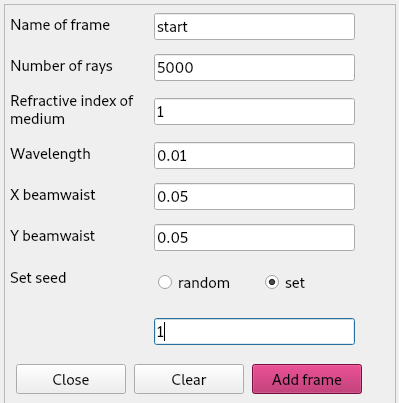
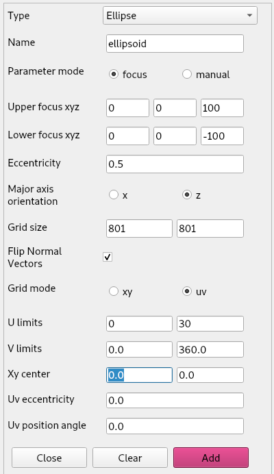
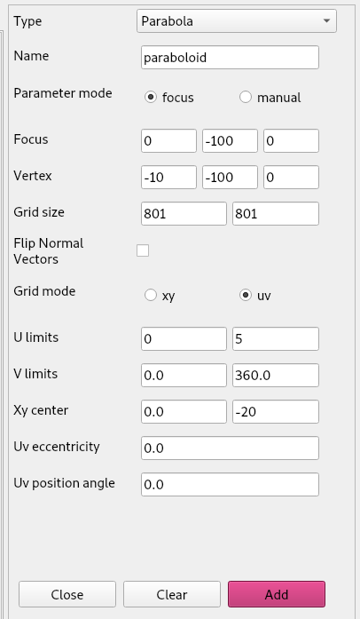
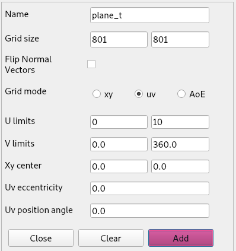
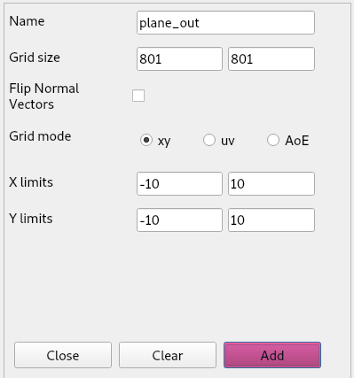
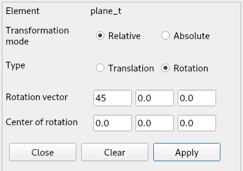
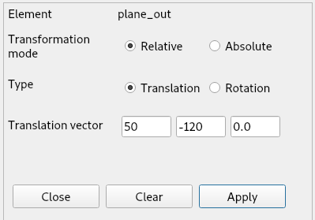
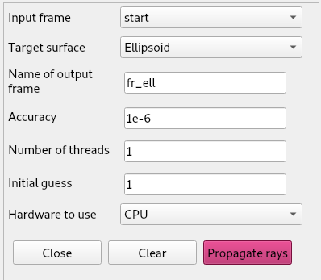

# PyPO GUI Tutorial: more advanced optical systems and ray-tracing options.

In the previous tutorial we built a simple optical system consisting of a paraboloid. We then performed a ray-trace from the initial frame of rays to the paraboloid surface, and from the paraboloid we found the focus of the frame by calling the s.findRTfocus method. We did all of this using the tubular ray-trace frame input.

In this tutorial, we will introduce Gaussian ray-trace frames. We will then create an optical setup that is slightly more advanced, where we try to generate a collimated beam from a Gaussian ray-trace beam.   

## Initializing a gaussian ray trace frame

In the *Ray-Trace* menu select *Make Frame* > *Gaussian* and we fill in the following parameters:

We will translate the frame upwards by 100 units.

If we now plot this frame in the x,y plane, it will look like this:

Next we will define a paraboloid and ellipsoid and two planes with the following parameters

|||
|-----------|-----------|
|||
|||

Then we do the following transformations:

|||
|-----------|-----------|
|||
|||

In the *Ray-tracer* menu we select *Propagate rays* and we do the following propagations. Note that each propagation generates a new frame. To be able to select this frame as input frame for a next propagation, we have to reopen the form from the menu bar.

|||
|-----------|-----------|
|||
||| 

Now plotting the rayTrace will show the following plot:

