# PyPO GUI Tutorial: performing physical optics propagations.

In this tutorial we will perform of a physical optics propagation on the same optical system  

## Setup
We start by loading our saved system from the previous tutorial. From the *Systems* menu we select *Load system*

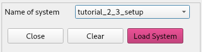

In the previous tutorial we purposefully oversized the off-axis paraboloid reflector for illustrative purposes. This time, we size the paraboloid in such a way that the illuminating beam has an edge taper between -10 and -15 dB.

We remove the paraboloid from the element options in the workspace:

And we add a new Paraboloid

Next we define a circular plane (by giving it uv limits rather than xy) in the upper focus of the ellipsoid. 

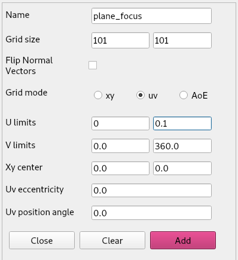

Before translating our plane to position, we define a Gaussian beam. This is important as the Gaussian beams are always defined with their focus in the origin.

From the *Physical-optics* menu we select *initialize beam > Gaussian beam > Vectorial* and we fill in the form as such:

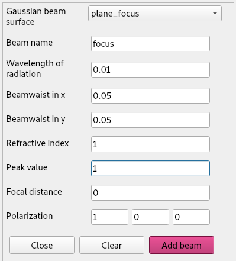

After clicking *Add beam* we can see that a field and a current have been added to the *PO-* tab of the workspace.

Now we can translate our *plane_focus* to position at (0, 0, 100).

## Propagation
Now we can propagate our beam through the system. From the *Physical-optics* menu we select *Propagate beam > To surface*. The we do the following propagations  
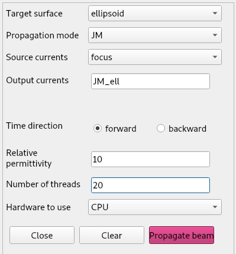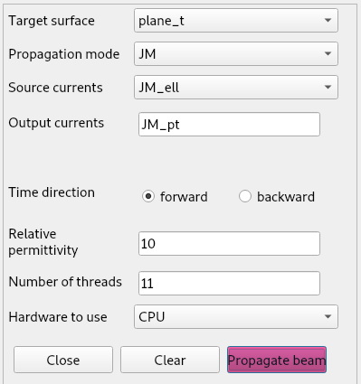
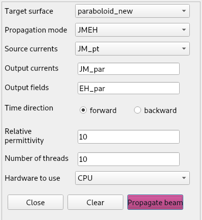

We set, for the first two propagations, the 'mode' parameter to 'JM'. This means we only store the calculated JM currents on the target surface. If we specify 'EH', such as for the last propagation, we only save the illuminating field on the target surface. If we want both, we specify 'mode' as 'JMEH'. Another option, 'FF' for far-field, will be explained in more detail below. The last option, 'EHP', stores the reflected field and corresponding Poynting vectors. With this option it is possible to do a combined ray-trace and PO approach. This will be introduced in a later tutorial.

Now we can plot the beam that we propagated through the system onto the paraboloid. 

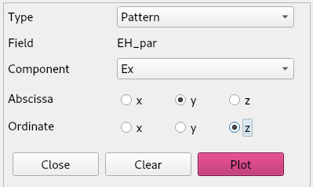
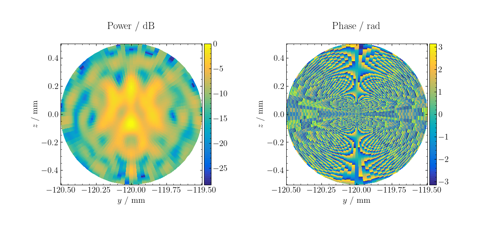

## Propagation to the far-field
We can create a far-field element by adding a plane and setting its grid-mode parametrization to AoE (Azimuth-over-Elevation). Then we propagate the field from our field EH_par to this far-field element. This can be done from the *Physical-optics* menu by selecting *Propagate Beam > To far-field*.

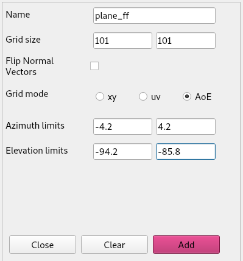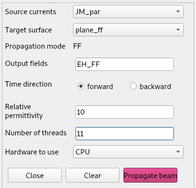
Creating a far-field object Propagating to far-field

If we now plot the generated *EH_FF* field it looks like this:   
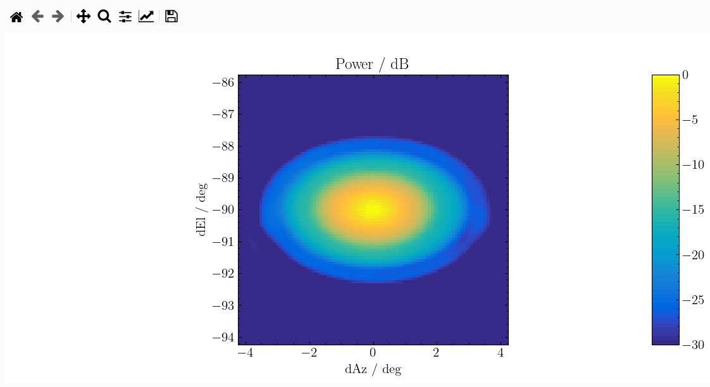 

Note that this image is noisy. You would expect something like this:

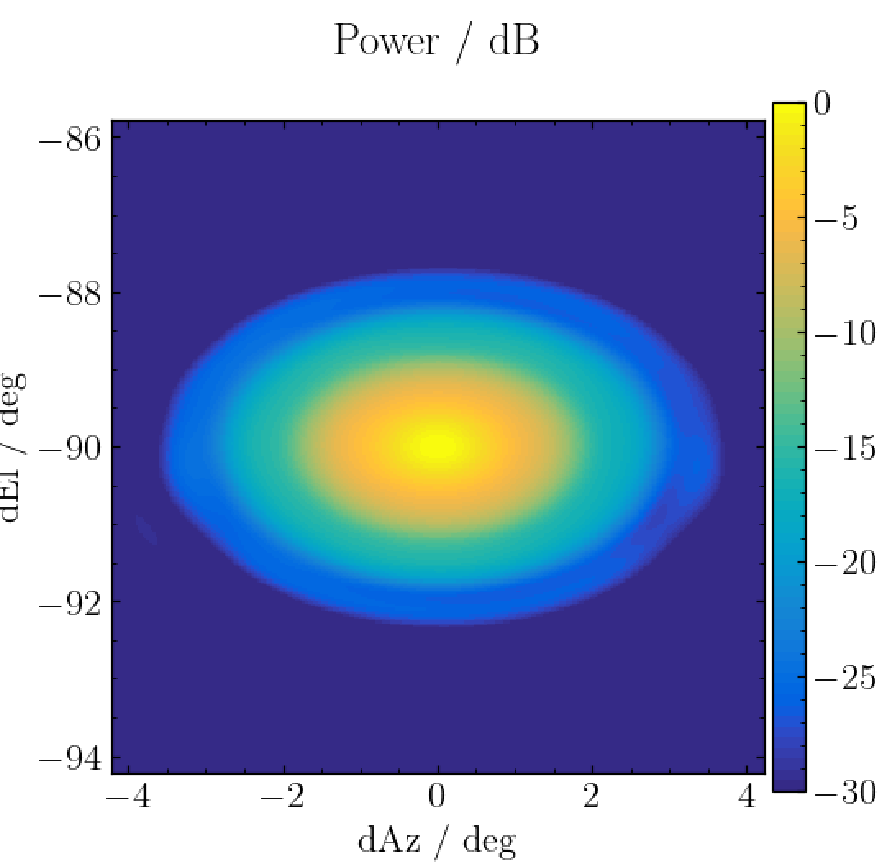 

This is due to th low resolution in the reflectors. 

## Challenge
Note that for doing PO propagation the software has to do the calculations for every pixel in the source for every pixel in the target. The complexity of these operations is Big-oh(n^4). The challenge is to find the right resolutions so the image is reasonably accurate while the runtime is doable. See Tutorial3.ipynb for the resolutions we used to generate the last image. 
